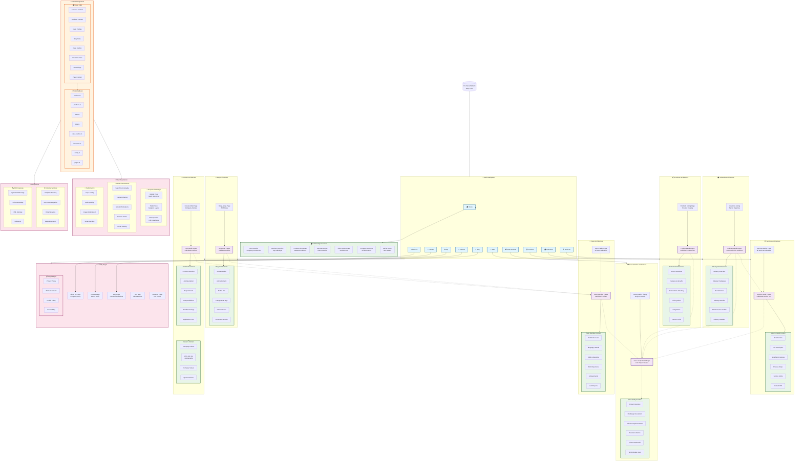

# I-Varse Website Logical Structure

```mermaid
flowchart TD
    %% Root Entry Point
    ROOT[("🌐 I-Varse Website<br/>Entry Point")]
    
    %% Main Navigation Structure
    subgraph NAVIGATION["🧭 Main Navigation"]
        direction TB
        HOME["🏠 Home"]
        ABOUT["ℹ️ About Us"]
        SERVICES["🛠️ Services"]
        PRODUCTS["📦 Products"]
        INDUSTRIES["🏭 Industries"]
        CASESTUDIES["📊 Case Studies"]
        TEAM["👥 Team"]
        BLOG["📝 Blog"]
        CAREERS["💼 Careers"]
        CONTACT["📞 Contact"]
        FAQ["❓ FAQ"]
    end
    
    %% Home Page Components
    subgraph HOME_COMPONENTS["🏠 Home Page Sections"]
        direction TB
        HERO_HOME["Hero Section<br/>Company Introduction"]
        SERVICES_PREVIEW["Services Overview<br/>Key Offerings"]
        PRODUCTS_PREVIEW["Products Showcase<br/>Featured Solutions"]
        CASESTUDIES_PREVIEW["Success Stories<br/>Client Results"]
        TESTIMONIALS_HOME["Client Testimonials<br/>Social Proof"]
        STATS_HOME["Company Statistics<br/>Achievements"]
        CTA_HOME["Call to Action<br/>Get Started"]
    end
    
    %% Services Structure
    subgraph SERVICES_STRUCTURE["🛠️ Services Architecture"]
        direction TB
        SERVICES_LIST["Services Listing Page<br/>All Services Overview"]
        SERVICE_DETAIL["Service Detail Pages<br/>Individual Service Info"]
        
        subgraph SERVICE_CONTENT["Service Detail Content"]
            direction LR
            SERV_HERO["Hero Section"]
            SERV_DESC["Full Description"]
            SERV_BENEFITS["Benefits & Features"]
            SERV_PROCESS["Process Steps"]
            SERV_FAQS["Service FAQs"]
            SERV_CTA["Contact CTA"]
        end
    end
    
    %% Products Structure
    subgraph PRODUCTS_STRUCTURE["📦 Products Architecture"]
        direction TB
        PRODUCTS_LIST["Products Listing Page<br/>Product Catalog"]
        PRODUCT_DETAIL["Product Detail Pages<br/>Individual Product Info"]
        
        subgraph PRODUCT_CONTENT["Product Detail Content"]
            direction LR
            PROD_HERO["Hero & Overview"]
            PROD_FEATURES["Features & Benefits"]
            PROD_GALLERY["Screenshots & Gallery"]
            PROD_PRICING["Pricing Plans"]
            PROD_INTEGRATIONS["Integrations"]
            PROD_CTA["Demo & Trial"]
        end
    end
    
    %% Case Studies Structure
    subgraph CASESTUDIES_STRUCTURE["📊 Case Studies Architecture"]
        direction TB
        CASESTUDIES_LIST["Case Studies Listing<br/>Project Portfolio"]
        CASESTUDY_DETAIL["Case Study Detail Pages<br/>Full Project Stories"]
        
        subgraph CASESTUDY_CONTENT["Case Study Content"]
            direction LR
            CS_HERO["Project Overview"]
            CS_CHALLENGE["Challenge Description"]
            CS_SOLUTION["Solution Implementation"]
            CS_RESULTS["Results & Metrics"]
            CS_TESTIMONIAL["Client Testimonial"]
            CS_TECH["Technologies Used"]
        end
    end
    
    %% Industries Structure
    subgraph INDUSTRIES_STRUCTURE["🏭 Industries Architecture"]
        direction TB
        INDUSTRIES_LIST["Industries Listing<br/>Sector Expertise"]
        INDUSTRY_DETAIL["Industry Detail Pages<br/>Sector-Specific Solutions"]
        
        subgraph INDUSTRY_CONTENT["Industry Detail Content"]
            direction LR
            IND_HERO["Industry Overview"]
            IND_CHALLENGES["Industry Challenges"]
            IND_SOLUTIONS["Our Solutions"]
            IND_BENEFITS["Industry Benefits"]
            IND_CASESTUDIES["Related Case Studies"]
            IND_STATS["Industry Statistics"]
        end
    end
    
    %% Team Structure
    subgraph TEAM_STRUCTURE["👥 Team Architecture"]
        direction TB
        TEAM_LIST["Team Listing Page<br/>All Team Members"]
        TEAM_DETAIL["Team Member Pages<br/>Individual Profiles"]
        
        subgraph TEAM_CONTENT["Team Member Content"]
            direction LR
            TEAM_HERO["Profile Overview"]
            TEAM_BIO["Biography & Role"]
            TEAM_SKILLS["Skills & Expertise"]
            TEAM_EXPERIENCE["Work Experience"]
            TEAM_ACHIEVEMENTS["Achievements"]
            TEAM_PROJECTS["Led Projects"]
        end
    end
    
    %% Blog Structure
    subgraph BLOG_STRUCTURE["📝 Blog Architecture"]
        direction TB
        BLOG_LIST["Blog Listing Page<br/>All Articles"]
        BLOG_DETAIL["Blog Post Pages<br/>Individual Articles"]
        
        subgraph BLOG_CONTENT["Blog Post Content"]
            direction LR
            BLOG_HERO["Article Header"]
            BLOG_CONTENT_MAIN["Article Content"]
            BLOG_AUTHOR["Author Info"]
            BLOG_CATEGORIES["Categories & Tags"]
            BLOG_RELATED["Related Posts"]
            BLOG_COMMENTS["Comments Section"]
        end
    end
    
    %% Careers Structure
    subgraph CAREERS_STRUCTURE["💼 Careers Architecture"]
        direction TB
        CAREERS_MAIN["Careers Main Page<br/>Company Culture"]
        JOB_DETAIL["Job Detail Pages<br/>Individual Positions"]
        
        subgraph CAREERS_CONTENT["Careers Content"]
            direction LR
            CAR_HERO["Company Culture"]
            CAR_BENEFITS["Why Join Us<br/>Job Benefits"]
            CAR_VALUES["Company Values"]
            CAR_JOBS["Open Positions"]
        end
        
        subgraph JOB_CONTENT["Job Detail Content"]
            direction LR
            JOB_HERO["Position Overview"]
            JOB_DESC["Job Description"]
            JOB_REQ["Requirements"]
            JOB_RESP["Responsibilities"]
            JOB_BENEFITS_DETAIL["Benefits Package"]
            JOB_APPLY["Application Form"]
        end
    end
    
    %% Utility Pages
    subgraph UTILITY_PAGES["🔧 Utility Pages"]
        direction TB
        ABOUT_MAIN["About Us Page<br/>Company Story"]
        CONTACT_MAIN["Contact Page<br/>Get in Touch"]
        FAQ_MAIN["FAQ Page<br/>Common Questions"]
        
        subgraph LEGAL_PAGES["📋 Legal Pages"]
            direction LR
            PRIVACY["Privacy Policy"]
            TERMS["Terms of Service"]
            COOKIES["Cookie Policy"]
            ACCESSIBILITY["Accessibility"]
        end
        
        SITEMAP_PAGE["Site Map<br/>Site Structure"]
        ERROR_404["404 Error Page<br/>Not Found"]
    end
    
    %% Data Management Layer
    subgraph DATA_LAYER["💾 Data Management"]
        direction TB
        
        subgraph STRAPI_CMS["🎛️ Strapi CMS"]
            direction LR
            CMS_SERVICES["Services Content"]
            CMS_PRODUCTS["Products Content"]
            CMS_TEAM["Team Profiles"]
            CMS_BLOG["Blog Posts"]
            CMS_CASES["Case Studies"]
            CMS_INDUSTRIES["Industries Data"]
            CMS_JOBS["Job Listings"]
            CMS_PAGES["Page Content"]
        end
        
        subgraph STATIC_FALLBACK["📂 Static Fallback"]
            direction LR
            STATIC_SERVICES["services.ts"]
            STATIC_PRODUCTS["products.ts"]
            STATIC_TEAM["team.ts"]
            STATIC_BLOG["blog.ts"]
            STATIC_CASES["case-studies.ts"]
            STATIC_INDUSTRIES["industries.ts"]
            STATIC_CONFIG["config.ts"]
            STATIC_PAGES["pages.ts"]
        end
    end
    
    %% User Experience Layer
    subgraph UX_LAYER["🎨 User Experience"]
        direction TB
        
        subgraph RESPONSIVE_DESIGN["📱 Responsive Design"]
            direction LR
            MOBILE["Mobile View<br/>Touch Optimized"]
            TABLET["Tablet View<br/>Adaptive Layout"]
            DESKTOP["Desktop View<br/>Full Experience"]
        end
        
        subgraph INTERACTIVE_FEATURES["⚡ Interactive Features"]
            direction LR
            SEARCH["Search Functionality"]
            FILTERS["Content Filtering"]
            ANIMATIONS["Smooth Animations"]
            FORMS["Contact Forms"]
            SOCIAL_SHARE["Social Sharing"]
        end
        
        subgraph PERFORMANCE["🚀 Performance"]
            direction LR
            LAZY_LOADING["Lazy Loading"]
            CODE_SPLITTING["Code Splitting"]
            IMAGE_OPT["Image Optimization"]
            CACHING["Smart Caching"]
        end
    end
    
    %% Integration Layer
    subgraph INTEGRATION_LAYER["🔌 Integrations"]
        direction TB
        
        subgraph EXTERNAL_SERVICES["🌐 External Services"]
            direction LR
            ANALYTICS["Analytics Tracking"]
            ERPNEXT["ERPNext Integration"]
            EMAIL["Email Services"]
            MAPS["Maps Integration"]
        end
        
        subgraph SEO_FEATURES["🔍 SEO Features"]
            direction LR
            META_TAGS["Dynamic Meta Tags"]
            STRUCTURED_DATA["Schema Markup"]
            SITEMAP_XML["XML Sitemap"]
            ROBOTS_TXT["Robots.txt"]
        end
    end
    
    %% Main Connections
    ROOT --> NAVIGATION
    
    %% Navigation to Main Pages
    NAVIGATION --> HOME
    NAVIGATION --> ABOUT
    NAVIGATION --> SERVICES
    NAVIGATION --> PRODUCTS
    NAVIGATION --> INDUSTRIES
    NAVIGATION --> CASESTUDIES
    NAVIGATION --> TEAM
    NAVIGATION --> BLOG
    NAVIGATION --> CAREERS
    NAVIGATION --> CONTACT
    NAVIGATION --> FAQ
    
    %% Home Page Connections
    HOME --> HOME_COMPONENTS
    
    %% Service Architecture
    SERVICES --> SERVICES_STRUCTURE
    SERVICES_LIST --> SERVICE_DETAIL
    SERVICE_DETAIL --> SERVICE_CONTENT
    
    %% Product Architecture
    PRODUCTS --> PRODUCTS_STRUCTURE
    PRODUCTS_LIST --> PRODUCT_DETAIL
    PRODUCT_DETAIL --> PRODUCT_CONTENT
    
    %% Case Studies Architecture
    CASESTUDIES --> CASESTUDIES_STRUCTURE
    CASESTUDIES_LIST --> CASESTUDY_DETAIL
    CASESTUDY_DETAIL --> CASESTUDY_CONTENT
    
    %% Industries Architecture
    INDUSTRIES --> INDUSTRIES_STRUCTURE
    INDUSTRIES_LIST --> INDUSTRY_DETAIL
    INDUSTRY_DETAIL --> INDUSTRY_CONTENT
    
    %% Team Architecture
    TEAM --> TEAM_STRUCTURE
    TEAM_LIST --> TEAM_DETAIL
    TEAM_DETAIL --> TEAM_CONTENT
    
    %% Blog Architecture
    BLOG --> BLOG_STRUCTURE
    BLOG_LIST --> BLOG_DETAIL
    BLOG_DETAIL --> BLOG_CONTENT
    
    %% Careers Architecture
    CAREERS --> CAREERS_STRUCTURE
    CAREERS_MAIN --> JOB_DETAIL
    CAREERS_STRUCTURE --> CAREERS_CONTENT
    JOB_DETAIL --> JOB_CONTENT
    
    %% Utility Pages
    ABOUT --> ABOUT_MAIN
    CONTACT --> CONTACT_MAIN
    FAQ --> FAQ_MAIN
    NAVIGATION --> UTILITY_PAGES
    
    %% Data Layer Connections
    STRAPI_CMS -.-> STATIC_FALLBACK
    DATA_LAYER --> UX_LAYER
    DATA_LAYER --> INTEGRATION_LAYER
    
    %% Cross-References and Relationships
    SERVICE_DETAIL -.-> CASESTUDY_DETAIL
    PRODUCT_DETAIL -.-> CASESTUDY_DETAIL
    INDUSTRY_DETAIL -.-> SERVICE_DETAIL
    INDUSTRY_DETAIL -.-> CASESTUDY_DETAIL
    TEAM_DETAIL -.-> CASESTUDY_DETAIL
    BLOG_DETAIL -.-> TEAM_DETAIL
    JOB_DETAIL -.-> TEAM_DETAIL
    
    %% Styling
    classDef mainPage fill:#e1f5fe,stroke:#01579b,stroke-width:2px
    classDef detailPage fill:#f3e5f5,stroke:#4a148c,stroke-width:2px
    classDef contentSection fill:#e8f5e8,stroke:#1b5e20,stroke-width:2px
    classDef dataLayer fill:#fff3e0,stroke:#e65100,stroke-width:2px
    classDef utilityPage fill:#fce4ec,stroke:#880e4f,stroke-width:2px
    
    class HOME,ABOUT,SERVICES,PRODUCTS,INDUSTRIES,CASESTUDIES,TEAM,BLOG,CAREERS,CONTACT,FAQ mainPage
    class SERVICE_DETAIL,PRODUCT_DETAIL,CASESTUDY_DETAIL,INDUSTRY_DETAIL,TEAM_DETAIL,BLOG_DETAIL,JOB_DETAIL detailPage
    class HOME_COMPONENTS,SERVICE_CONTENT,PRODUCT_CONTENT,CASESTUDY_CONTENT,INDUSTRY_CONTENT,TEAM_CONTENT,BLOG_CONTENT,CAREERS_CONTENT,JOB_CONTENT contentSection
    class DATA_LAYER,STRAPI_CMS,STATIC_FALLBACK dataLayer
    class UTILITY_PAGES,LEGAL_PAGES,UX_LAYER,INTEGRATION_LAYER utilityPage
```
